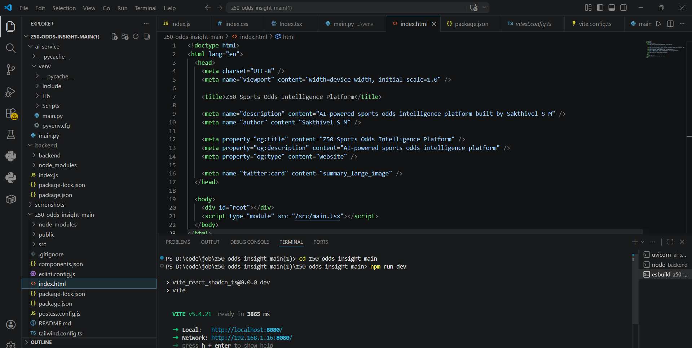
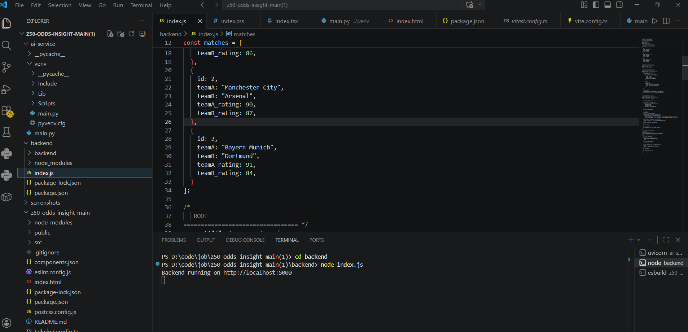
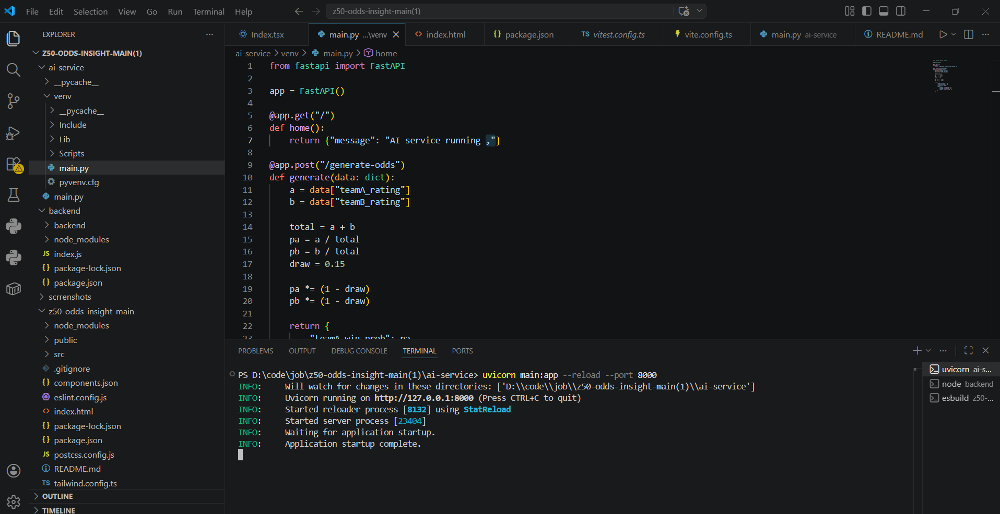
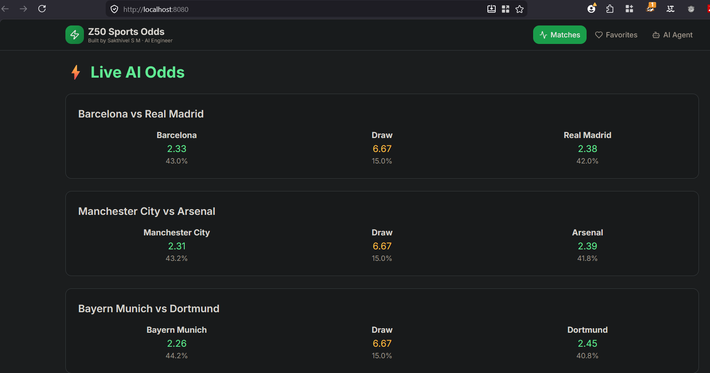
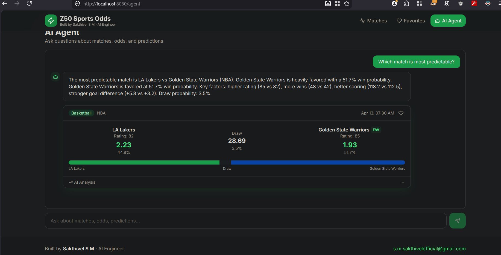

## Problem Statement

Build a Sports Odds Intelligence Platform that simulates a real-world betting engine pipeline:

Data → Model → API → UI

The system should:
- Display sports matches to users
- Dynamically generate odds using a Python-based model (not hardcoded)
- Use a Node.js backend to handle APIs and integrate with the AI service
- Provide an AI agent that answers prediction-related questions
- Show matches, probabilities, and odds in a frontend UI

The goal is to demonstrate full-stack development, AI integration, and service-to-service communication.
## How It Works

1. Frontend requests match data from backend
2. Backend fetches match details
3. Backend sends match data to Python AI service
4. Python calculates win probabilities
5. Probabilities are converted into betting odds
6. Backend returns enriched data to frontend
7. UI displays matches with odds and predictions

---

## API Endpoints

### GET /matches
Returns all matches with AI-generated odds and probabilities.

### POST /agent/query
Accepts a question and returns prediction insights.

Example:

{
"question": "Who will win?"
}

### Python AI Service

#### POST /generate-odds
Generates probabilities and odds based on team ratings.

Example Request:

{
"teamA": "Barcelona",
"teamB": "Real Madrid",
"teamA_rating": 88,
"teamB_rating": 86
}

---

## AI Model Logic

The model uses a simple rating-based probability approach:

- Higher team rating → higher win probability
- Probabilities are normalized
- A fixed draw probability is included
- Odds are calculated as inverse of probability

## Screenshots

### Frontend UI

### Backend Running

### AI Service

### Matches Output

### AI Agent Response

## Run Locally

### 1. Start AI Service

cd ai-service  
uvicorn main:app --reload --port 8000  

---

### 2. Start Backend

cd backend  
node index.js  

---

### 3. Start Frontend

cd z50-odds-insight-main  
npm run dev  

---

## Notes

- Odds are dynamically generated using a Python model
- No hardcoded values are used
- Demonstrates real-world service-to-service communication
- Clean and modular structure for scalability

---

## Author

Sakthivel S M  
AI Engineer  